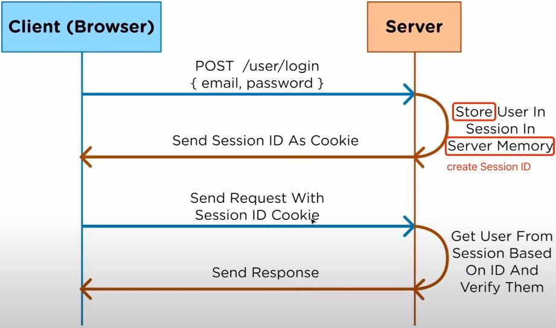
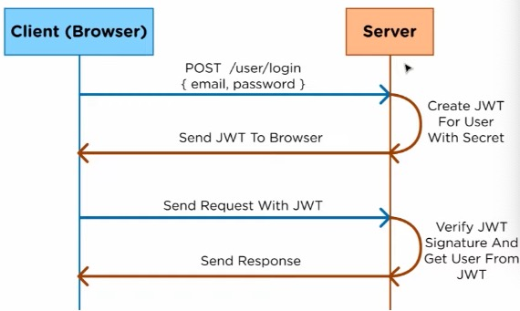
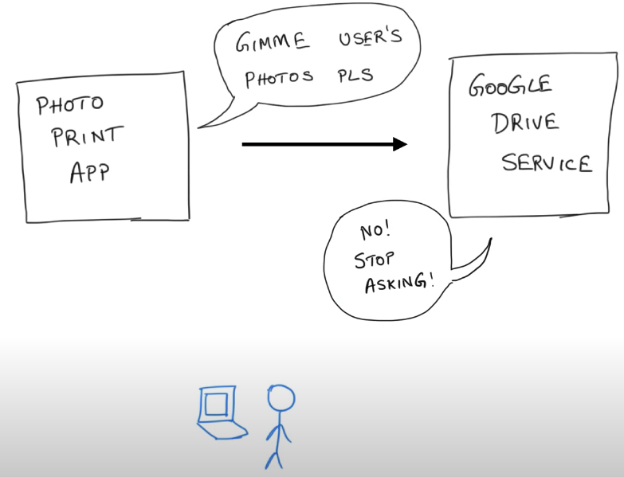
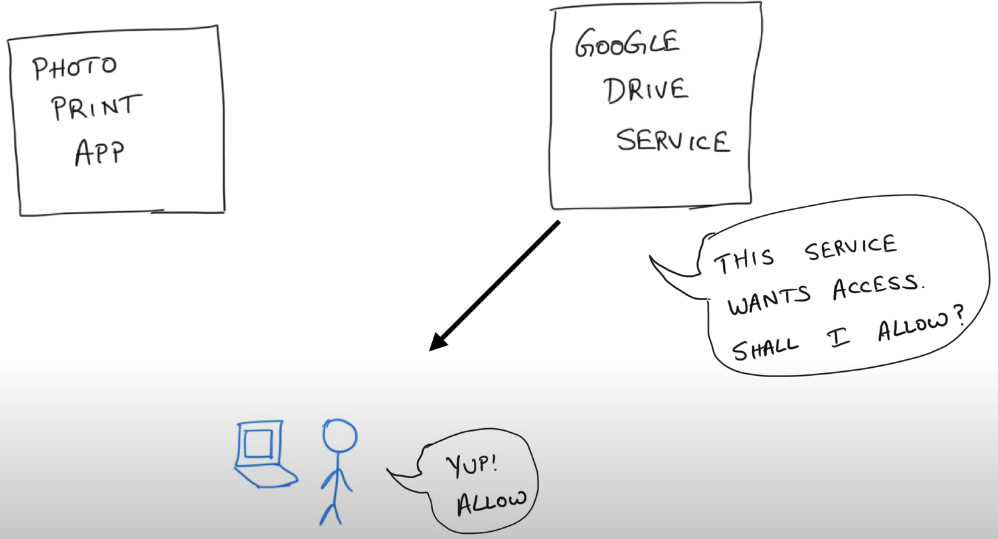
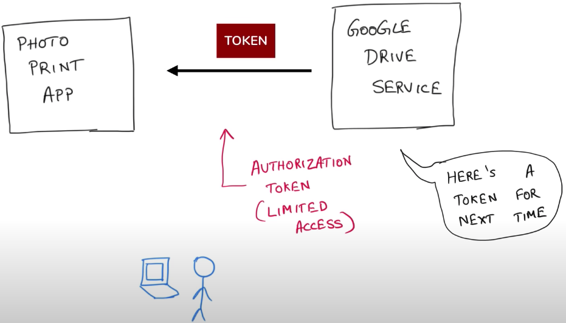
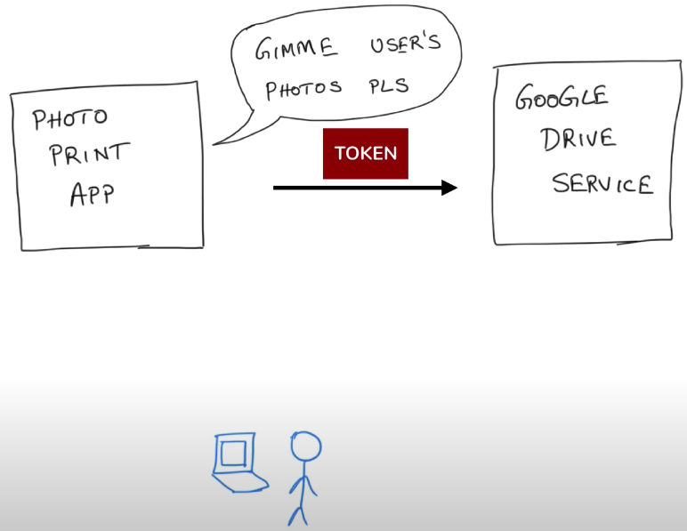

## 目录
- [Cookie-Session](#cookie-session)   
- [JWT](#jwt)
- [OAuth](#oauth)

## Cookie-Session(session认证)
- **Main point:** store user's information in the server memory;  
=> **Problem:** cannot deal web app with multiple servers;  
没有分布式架构，无法支持横向扩展。如果使用一个服务器，该模式完全没有问题。但是，如果它是服务器群集或面向服务的跨域体系结构的话，则需要一个统一的session数据库库来保存会话数据实现共享，这样负载均衡下的每个服务器才可以正确的验证用户身份。

customer <=> **Load Balancer** <=> servers



---
## JWT(token认证)
- JWT的数据结构:  
    1. Header
    2. Payload
    3. Signature: encode previous parts and sign 
   
header.payload.signature   
服务器验证身份后生成一个JSON对象并发送回用户:
```json
{s
    "UserName": "Chongchong",
    "Role": "Admin",
    "Expire": "2018-08-08 20:15:56"
}
```   
当用户与服务器通信时，客户在请求中发回JSON对象。服务器仅依赖于这个JSON对象来标识用户。为了防止用户篡改数据，服务器将在生成对象时添加签名; 服务器不保存任何会话数据，即服务器变为无状态，使其更容易扩展。(基于用户端存储)

- **Main point:** server stores nothing, the clients always carry/store all things themselves;   



---
## OAuth
Authorization between servers.   
允许用户让第三方应用（网站/app）访问该用户在另一网站（qq, 微博，微信等等）上存储的私密的资源（如照片，视频，联系人列表），而无需将用户名和密码提供给第三方应用。 

OAuth允许用户提供一个令牌token(能verify但不能changed)，而不是用户名和密码来访问他们存放在特定服务提供者的数据。每一个令牌授权一个特定的网站（例如，视频编辑网站)在特定的时段（例如，接下来的2小时内）内访问特定的资源（例如仅仅是某一相册中的视频）。这样，OAuth让用户可以授权第三方网站访问他们存储在另外服务提供者的某些特定信息，而非所有内容。


<center>
     
    &nbsp;&nbsp;&nbsp;&nbsp;&nbsp; =>  
    &nbsp;&nbsp;&nbsp;&nbsp;&nbsp;
    
<center>
    
<center>
    
    &nbsp;&nbsp;&nbsp;&nbsp;&nbsp; =>  
    &nbsp;&nbsp;&nbsp;&nbsp;&nbsp;
    
<center>


